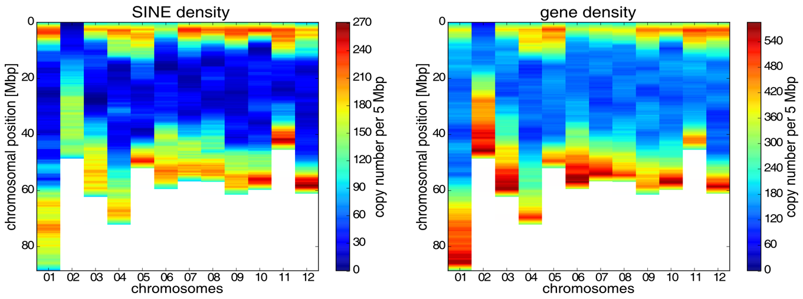
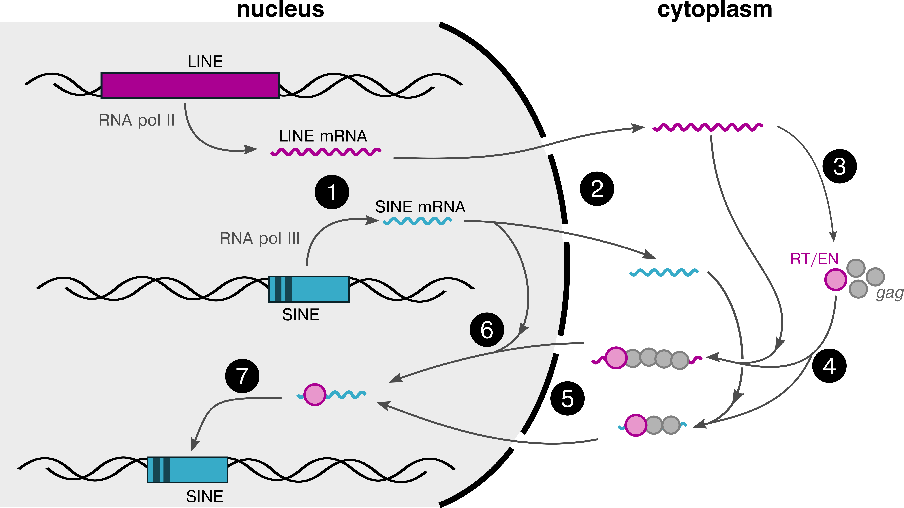
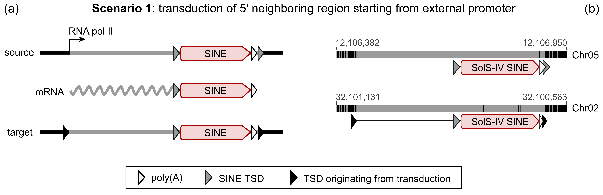

# Introducing Myself

My name is Kathrin Seibt and I'm a **computational biologist** with a background in molecular biology. My research focus has been on comparative genomics, transposable elements (repetitive DNA sequences), and molecular markers. 

In the laboratory I've been routinely conducting **molecular experiments** including DNA extraction, PCR, electrophoresis, and DNA sequencing - particularly in the context of molecular markers. Due to a high amount of samples I am used to planning, executing, documenting, and interpreting **large-scale experiments**. Besides, I have also applied a wide variety of other laboratory techniques in the fields of molecular biology, microbiology, and analytical chemistry.

I am programming in **Python** and **R** and have a general interest in problem solving, data mining, and visualization. In order to utilize various software tools and integrate command line tools, I am used to working both in a **Windows** and a **Linux** environment. Consequently, I particularly appreciate cross-platform tools. For data visualization and documentation I use common packages such as **matplotlib**, **ggplot2** and **RMarkDown**. 

Due to my previous research on repetitive DNA sequences, I am used to handling **large amounts of data**, design analyses and workflows, as well as apply **analytical** and **rational** criteria in order to solve challenging tasks. In this context, I **enjoy learning** and quickly integrate new technologies. I would describe myself as a curious, **intrinsically motivated** and **open-minded** person. In general, I love to work in a motivated and dedicated **team**, but I also appreciate diving into data **self-dependently**. To be able to reproduce and share my work, I value **documentation** to log workflows, record important resources or tools, and summarize results. I **routinely present** my data in **publications** and **talks** targeting different audiences and also used **social media** ([Twitter](https://twitter.com/kathse1984)) to share publications with the public.

After my career break for **maternity leave** I am now actively **looking for a new position**. I am keen to address challenging tasks, acquire novel skills, integrate new technologies and join a motivated team.

For further information regarding my professional profile, please see my [CV](./CV/).

# Introducing My Visualizations

I enjoy **data mining** and love to create **visualizations** that reveal and illustrate interesting findings. I want to highlight my recently developed cross-platform bioinformatic visualization tool **FlexiDot** available on [GitHub](https://github.com/molbio-dresden/flexidot).

To give you an impression of my work, I want to present some illustrations from my recent publications. 
- [comparative sequence analyses across 100 plant genomes](https://github.com/KathSe1984/ProfessionalProfile/#1-comparative-genomics-analysis-of-transposable-elements-in-100-plant-genomes)
- [chromosomal localization of repetitive sequences in nightshade plant](https://github.com/KathSe1984/ProfessionalProfile/#2-localization-of-short-transposable-elements-in-nightshade-plants)
- [my FlexiDot tool for visual sequence comparisons](https://github.com/KathSe1984/ProfessionalProfile/#3-visualization-tool-to-illustrate-structural-sequence-features)

Despite data analyses, I also enjoy creating schematic figures. For this, I use combined approaches with Python, R and Inkscape.

- [schematic representations of evolutionary mechanisms](https://github.com/KathSe1984/ProfessionalProfile/#4-schematic-figures-using-inkscape)

I also use programming for private tasks. For example, we've been travelling across southern Europe during our parental leave. Using R and Python, I created a map to illustrate our journey.

- [private travel journey](https://github.com/KathSe1984/ProfessionalProfile/#4-our-paternal-leave-journey)

## 1. Comparative genomics analysis of transposable elements in 100 plant genomes

This schematic representation created with **Inkscape and Python scripting** illustrates the modular similarities between the different families of short transposable elements (*right*) and links them to the plant orders where I have detected them with a custom **Python workflow** (*left side*).[3](#myfootnote3)

This **R analysis** summarizes the varing in the number of copies per genome for the different Angio-SINE families (*a left, b*) as well as the similarity of the copies to each other within the genome (*a right*). The phylogenetic relationships of the Angio-SINE families are illustrated as **SplitsTree network** (*c*).[3](#myfootnote3) 

## 2. Localization of short transposable elements in nightshade plants

The **R heatmap** confirms that the distribution of the 13.903 short interspersed nuclear elements (SINEs, *left*) on the twelve potato chromosomes is highly similar to the distribution of the annotated genes (*right*). In fact, 10% of the genes described in the nightshade plants potato, tomato, and pepper harbor at least one SINE copy.[1](#myfootnote1)

## 3. Visualization tool to illustrate structural sequence features

I developed the cross-platform Python tool **FlexiDot**[2](#myfootnote2) to compare DNA and protein sequences. FlexiDot provides highly customizable shading and calculation options. It is available on [GitHub](https://github.com/molbio-dresden/flexidot)] and according to its [Altmetric score](https://oxfordjournals.altmetric.com/details/41360826) FlexiDot is ranked among the **top 5% of publications** in the **journal Bioinformatics**. I would like to emphasize the detailed **documentation** provided as supporting material to target a wide range of users. 

I was able to use our FlexiDot tool to identify and illustrate modular similarities of short transposon families (Angio-SINEs) across a wide variety plant species. Here, the dotplot depicting the modularity is complemented by a heatmap of the sequence similarities.[2](#myfootnote2),[3](#myfootnote3) 

## 4. Schematic figures using Inkscape

In this illustration I show two evolutionary scenarios: The first one depicts a mechanism for genomic changes by transposable elements[1](#myfootnote1), the other one summarizes the evolutionary life cycle of a LINE and SINE transposons.

## 5. Our parental leave journey visualized with Python & R

During our parental leave in 2022 we made a unique trip across southern Europe. Thus, we organized and planned everything for our 77 day journey across Germany, Austria, Hungaria, Croatia, Bosnia, and Italy.

# References

## Selected Publications
 
<a name="myfootnote1">1.</a> Seibt, K. M., T. Wenke, K. Muders, B. Truberg & T. Schmidt (2016). *Short interspersed nuclear elements (SINEs) are abundant in Solanaceae and have a family-specific impact on gene structure and genome organization.* **Plant Journal** 86(3): 268-285. [[Weblink](https://doi.org/10.1111/tpj.13170)]

<a name="myfootnote2">2.</a> Seibt, K. M., T. Schmidt & T. Heitkam (2018). *FlexiDot: Highly customizable, ambiguity-aware dotplots for visual sequence analyses.* **Bioinformatics** 34(20): 3575-3577. [[Weblink](https://doi.org/10.1093/bioinformatics/bty395), [GitHub](https://github.com/molbio-dresden/flexidot)]

<a name="myfootnote3">3.</a>  Seibt, K. M., T. Schmidt & T. Heitkam (2019). *The conserved 3′ Angio-domain defines a superfamily of short interspersed nuclear elements (SINEs) in higher plants.* **Plant Journal** 101(3): 681–699. [[Weblink](https://doi.org/10.1111/tpj.14567)]

