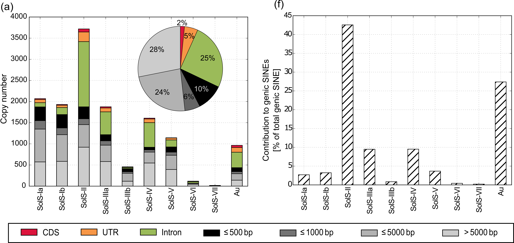

# Introducing Myself

My name is Kathrin Seibt and I'm a **computational biologist** with a background in molecular biology. My research focus has been on comparative genomics, transposable elements (repetitive DNA sequences), and molecular markers.

I am programming in **Python** and **R** and have a general interest in programming, problem solving, data mining, and visualization. In order to utilize various software tools and integrate command line tools, I am used to working both in a **Windows** and a **Linux** environment. Consequently, I particularly appreciate cross-platform tools. For data visualization and documentation, I use common packages such as **matplotlib**, **ggplot2** and **RMarkDown**. 

Due to my previous research on repetitive DNA sequences, I am used to handling **large amounts of data**, design analyses and workflows, as well as apply **analytical** and **rational** criteria in order to solve challenging tasks. In this context, I **enjoy learning** and and quickly integrate new technologies. I would describe myself as a curious, **intrinsically motivated** and **rather introverted** person. In general, I love to work in a motivated and dedicated **team**, but I also appreciate diving into data **self-dependently**. To be able to reproduce and share my work, I value **documentation** to log workflows, record important resources or tools, and summarize results. I **routinely present** my data in **publications** and **talks** targetting different audiences and also use **social media** ([Twitter](https://twitter.com/kathse1984)) to share publications with the public.

# Introducing My Visualizations

I enjoy **data mining** and love to create **visualizations** that reveal and illustrate interesting findings. I want to highlight my recently developed cross-platform bioinformatic visualization tool **FlexiDot** available on [GitHub](https://github.com/molbio-dresden/flexidot).

To give you an impression of my work, I want to present some illustrations from my recent publications. 

## 1. Short transposable elements are associated with genes in nightshade plants

The distribution of short interspersed nuclear elements (SINEs) on the twelve tomato chromosomes is highly similar to the distribution of the annotated genes [Ref 1].

Different families of these transposable element (x-axis) are associated to genes to a varying degree in potato (a) and, consistently, in the analyzed nightshade plants in general (b) [Ref 1].

## 2. Visualization tool to illustrate structural sequence features

I developed the cross-platform Python-tool **FlexiDot** to compare DNA and protein sequences with highly customizable shading and calculation options [Ref 2, [GitHub](https://github.com/molbio-dresden/flexidot)]. According to its Altmetric score, FlexiDot is among the **top 3% of publications** in the **journal Bioinformatics**. I would like to emphasize the detailed **documentation** as supporting material to target a wide range of users. 

I was able to use our new tool to identify and illustrate modular similarities of short transposons families (Angio-SINEs) across a wide variety plant species [Refs 2,3]. 

## 3. Comparative genomics analysis of transposable elements in 100 plant genomes

Schematic illustration of the modular similarities between different families of short transposable elements (*right*) and their phylogenetic assignment to different plant orders (*left side*)  [Ref 3]. 

Characterization of the copy number and similarity of all Angio-SINE families in the analyzed plant species [Ref 3]. 

# References

> 1. Seibt, K. M., T. Wenke, et al. (2016). *Short interspersed nuclear elements (SINEs) are abundant in Solanaceae and have a family-specific impact on gene structure and genome organization.* **Plant Journal** 86(3): 268-285. [[Weblink](https://doi.org/10.1111/tpj.13170)]
>
> 2. Seibt, K. M., T. Schmidt, et al. (2018). *FlexiDot: Highly customizable, ambiguity-aware dotplots for visual sequence analyses.* **Bioinformatics** 34(20): 3575-3577. [[Weblink](https://doi.org/10.1093/bioinformatics/bty395), [GitHub](https://github.com/molbio-dresden/flexidot)]
>
> 3. Seibt, K. M., T. Schmidt, et al. (2019). *The conserved 3′ Angio-domain defines a superfamily of short interspersed nuclear elements (SINEs) in higher plants.* **Plant Journal** 101(3): 681–699. [[Weblink](https://doi.org/10.1111/tpj.14567)]

